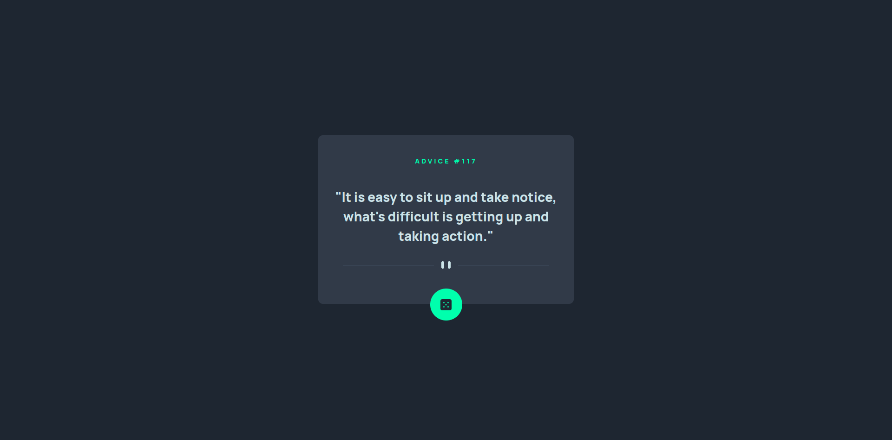
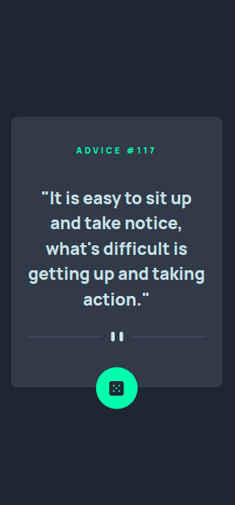

# Frontend Mentor - Advice generator app solution

This is a solution to the [Advice generator app challenge on Frontend Mentor](https://www.frontendmentor.io/challenges/advice-generator-app-QdUG-13db). Frontend Mentor challenges help you improve your coding skills by building realistic projects.

## Table of contents

- [Overview](#overview)
  - [Screenshot](#screenshot)
  - [Links](#links)
- [My process](#my-process)
  - [Built with](#built-with)
  - [Useful resources](#useful-resources)

## Overview

### Screenshot

### Links

- Solution URL: [hriteek/advice_generator_app](https://github.com/hriteek/advice_generator_app)
- Live Site URL: [https://hriteek.github.io/advice_generator_app/](https://hriteek.github.io/advice_generator_app/)

## My process

### Built with

- Semantic HTML5 markup
- CSS custom properties
- Flexbox
- Mobile-first workflow

### Useful resources

- [Advice Slip API](https://api.adviceslip.com/) - Advice Slip JSON API
- [CSS Reset](https://piccalil.li/blog/a-modern-css-reset/) - I used this for reset all the default browser CSS
